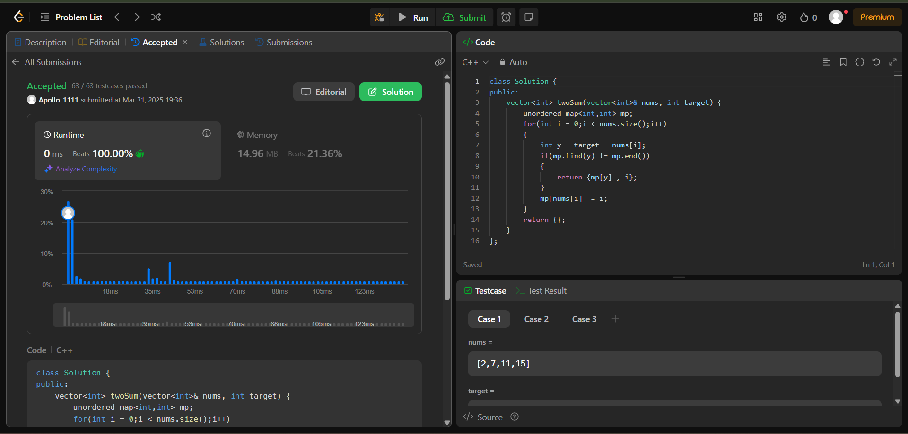
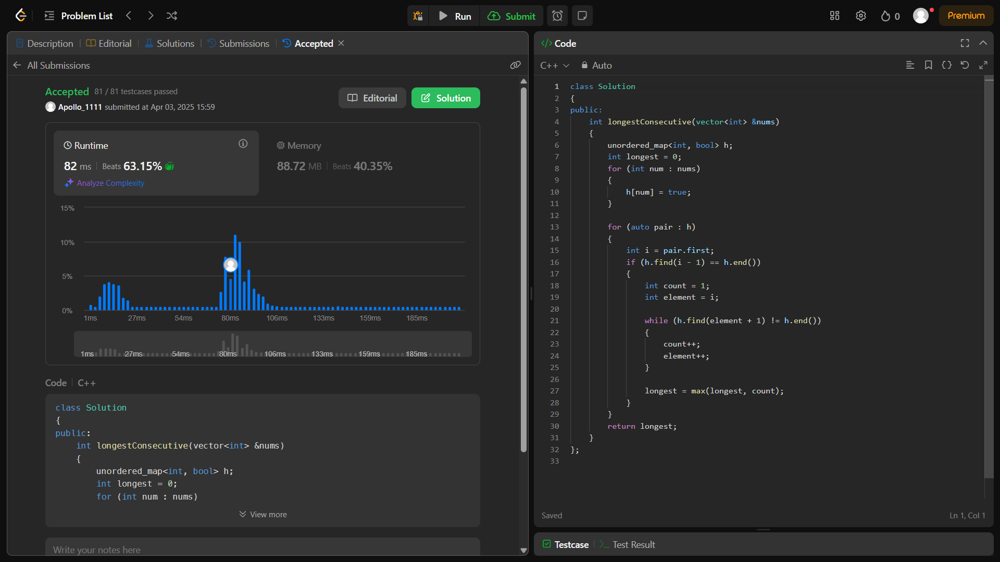
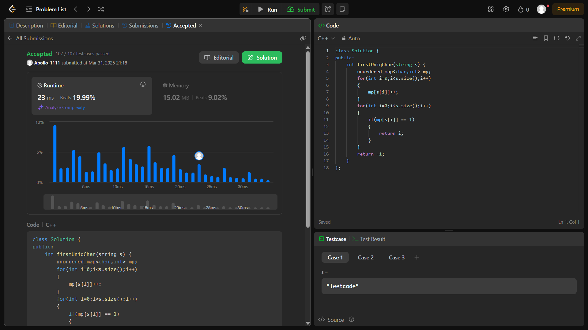
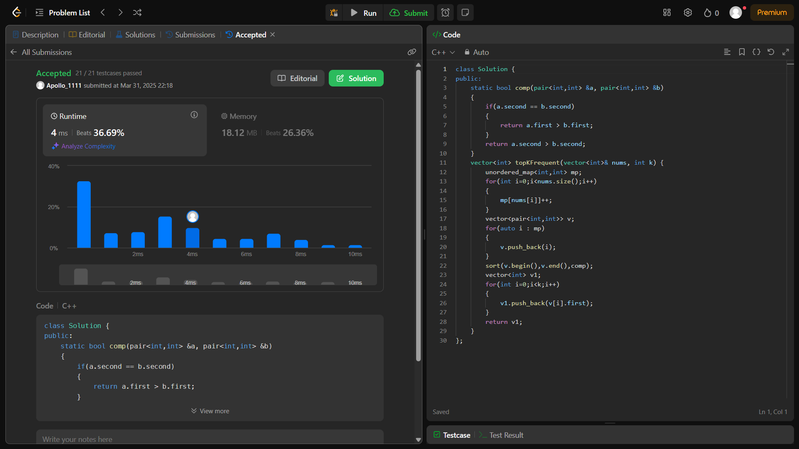
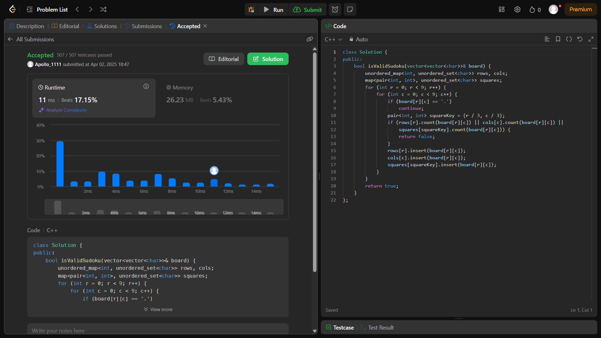

<h1><b>IT206_Map_Problems_Solutions</b></h1>
<h2><b>Name and Student ID</b></h2>

<li>Dhruvam Panchal - 202401415 </li>

<h2><b>Overview</b></h2>

<li>Submission links for each of the questions are given below along with the screenshots of the accepted solution in LeetCode. Click on any of the question, and it will direct you to the submission page of the accepted solution of my LeetCode account. Detailed solutions to each code is available in src folder and appropriate comments are added for better understanding.</li>

<ol>
  <li type="I"><a href="https://leetcode.com/problems/two-sum/submissions/1592100848">Two-sum</a></li>
  

  

  

  <li type="I"><a href="https://leetcode.com/problems/longest-consecutive-sequence/submissions/1595450630">Longest-consecutive-sequence</a></li>
  

  

  

  <li type="I"><a href="https://leetcode.com/problems/first-unique-character-in-a-string/submissions/1592189110">First-unique-character-in-a-string</a></li>
  

  

  

  <li type="I"><a href="https://leetcode.com/problems/top-k-frequent-elements/submissions/1592245124">Top-k-frequent-elements</a></li>
  

  

  

  <li type="I"><a href="https://leetcode.com/problems/valid-sudoku/submissions/1594409961">Valid-sudoku</a></li>
  

  

  

</ol>